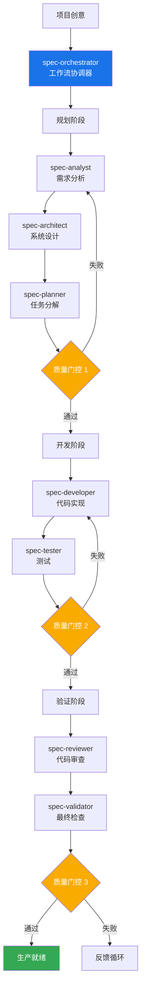

# Claude Sub-Agent Spec 工作流系统

基于 Claude Code Sub-Agents 功能构建的综合性 AI 驱动开发工作流系统。该系统通过协调多个专业化 AI 代理，将项目创意转化为生产就绪的代码。

## 目录

- [概述](#概述)
- [系统架构](#系统架构)
- [安装指南](#安装指南)
- [快速开始](#快速开始)
- [Slash 命令使用](#slash-命令使用)
- [工作原理](#工作原理)
- [Agent 参考](#agent-参考)
- [使用示例](#使用示例)
- [质量门控](#质量门控)
- [最佳实践](#最佳实践)
- [高级用法](#高级用法)
- [故障排除](#故障排除)

## 概述

Spec 工作流系统利用 Claude Code 的 Sub-Agents 功能创建了一个多代理开发流水线。每个代理都是特定领域的专家，负责软件开发生命周期的特定方面，从需求分析到最终验证。

### 核心特性

- **自动化工作流**：从创意到生产代码的完整开发流水线
- **专业化专长**：每个代理专注于其专业领域
- **质量门控**：自动化检查点确保质量标准
- **灵活集成**：可与现有专业代理协同工作
- **全面文档**：每个阶段都生成详细的文档

### 主要优势

- 从概念到代码的开发速度提升 10 倍
- 通过自动化验证确保一致的质量
- 自动生成全面的文档
- 通过系统化流程减少错误
- 通过清晰的工作流程改善协作

## 系统架构



## 安装指南

### 前置要求

- Claude Code（最新版本）
- 已初始化的项目目录
- 对 AI 辅助开发的基本了解

### 安装步骤

1. **下载代理文件**

   ```bash
   # 方式 1：克隆仓库
   git clone https://github.com/zhsama/claude-sub-agent.git
   cd claude-sub-agent
   
   # 方式 2：下载所需的特定代理
   # 单个代理文件可在 agents/ 目录中获取
   ```

2. **复制代理和 slash 命令到项目的 Claude Code 目录**

   ```bash
   # 在你的项目中创建 .claude 目录结构
   mkdir -p .claude/agents .claude/commands
   
   # 从此仓库复制代理
   cp agents/* .claude/agents/
   
   # 复制 slash 命令（包括工作流恢复命令）
   cp commands/agent-workflow*.md .claude/commands/
   ```

3. **验证安装**

   你的项目结构应该如下所示：

   ```text
   your-project/
   ├── .claude/
   │   ├── commands/
   │   │   ├── agent-workflow.md         # 工作流启动命令
   │   │   ├── agent-workflow-resume.md  # 工作流恢复命令
   │   │   └── agent-workflow-list.md    # 工作流列表命令
   │   └── agents/
   │       ├── spec-analyst.md
   │       ├── spec-architect.md
   │       ├── spec-developer.md
   │       ├── spec-orchestrator.md
   │       ├── spec-planner.md
   │       ├── spec-reviewer.md
   │       ├── spec-tester.md
   │       ├── spec-validator.md
   │       └── ... (其他代理)
   └── ... (你的项目文件)
   ```

## 快速开始

### 基本使用

```bash
# 启动新项目工作流
询问 Claude："使用 spec-orchestrator 代理创建一个待办事项 Web 应用"

# 协调器将自动：
# 1. 分析需求
# 2. 设计架构
# 3. 规划任务
# 4. 实现代码
# 5. 编写测试
# 6. 审查和验证
```

### 简单示例

```markdown
你：使用 spec-orchestrator 创建一个个人博客平台

Claude (spec-orchestrator)：正在启动个人博客平台的工作流...

[规划阶段 - 45 分钟]
✓ 需求分析完成
✓ 架构设计完成
✓ 任务规划完成
✓ 质量门控 1：通过 (96/100)

[开发阶段 - 2 小时]
✓ 15 个任务已实现
✓ 测试编写完成
✓ 质量门控 2：通过 (88/100)

[验证阶段 - 30 分钟]
✓ 代码审查完成
✓ 最终验证完成
✓ 质量门控 3：通过 (91/100)

项目完成！生成的产物：
- requirements.md（需求文档）
- architecture.md（架构文档）
- 源代码（15 个文件）
- 测试套件（85% 覆盖率）
- 文档
```

## Slash 命令使用

使用我们的自定义 slash 命令，这是启动完整工作流最快的方式：

### 基本使用

```bash
/agent-workflow "创建一个带用户认证和实时更新功能的任务管理 Web 应用"
```

### 高级使用

```bash
# 高质量企业项目
/agent-workflow "开发一个包含客户管理和分析功能的 CRM 系统" --quality=95

# 快速原型开发
/agent-workflow "简单的个人博客网站" --quality=75 --skip-agent=spec-tester

# 基于现有需求
/agent-workflow "基于现有需求的移动应用" --skip-agent=spec-analyst

# 只运行特定阶段
/agent-workflow "微服务电商平台" --phase=planning
```

### 命令选项

- `--quality=[75-95]`: 设置质量门控阈值
- `--skip-agent=[agent名称]`: 跳过特定的 agent
- `--phase=[planning|development|validation|all]`: 运行特定阶段
- `--output-dir=[路径]`: 指定输出目录
- `--language=[zh|en]`: 文档语言

### 工作流恢复功能

当工作流被中断时，可以使用恢复功能继续之前的进度：

```bash
# 恢复特定工作流
/agent-workflow-resume <WORKFLOW_ID>

# 自动恢复最近的未完成工作流
/agent-workflow-resume

# 查看所有可恢复的工作流
/agent-workflow-list
```

#### 恢复功能特性

- **状态持久化**：自动保存工作流进度和上下文
- **智能恢复**：从最后完成的阶段继续执行
- **会话感知**：监控会话时间限制，自动暂停长时间任务
- **错误恢复**：处理状态损坏和丢失的工作流

**📖 完整的 slash 命令文档请参见 [commands/agent-workflow.md](./commands/agent-workflow.md)**

## 工作原理

### 1. Claude Code Sub-Agents 集成

根据 Claude Code 的文档，sub-agents 的工作方式：

- 在隔离的上下文窗口中运行
- 防止主对话的污染
- 允许专业化、聚焦的交互
- 基于任务上下文自动选择

我们的系统通过为每个开发阶段创建专业代理来利用这些特性。

### 2. 工作流阶段

#### 规划阶段

1. **spec-analyst**：分析需求并创建用户故事
2. **spec-architect**：设计系统架构
3. **spec-planner**：将工作分解为任务
4. **质量门控 1**：验证规划完整性

#### 开发阶段

1. **spec-developer**：基于任务实现代码
2. **spec-tester**：编写全面的测试
3. **质量门控 2**：验证代码质量

#### 验证阶段

1. **spec-reviewer**：审查代码最佳实践
2. **spec-validator**：最终生产就绪检查
3. **质量门控 3**：确保部署就绪

### 3. 代理通信

代理通过结构化文档进行通信：

- 每个代理产生特定的文档
- 下一个代理使用前一个的输出作为输入
- 协调器管理整个流程
- 质量门控确保一致性

## Agent 参考

### 工作流代理

| 代理 | 用途 | 输入 | 输出 |
|------|------|------|------|
| spec-orchestrator | 工作流协调 | 项目描述 | 状态报告、路由 |
| spec-analyst | 需求分析 | 用户描述 | requirements.md、user-stories.md |
| spec-architect | 系统设计 | 需求 | architecture.md、api-spec.md |
| spec-planner | 任务规划 | 架构 | tasks.md、test-plan.md |
| spec-developer | 实现 | 任务 | 源代码、单元测试 |
| spec-tester | 测试 | 代码 | 测试套件、覆盖率报告 |
| spec-reviewer | 代码审查 | 代码 | 审查报告、改进建议 |
| spec-validator | 最终验证 | 所有产物 | 验证报告、质量分数 |

### 专业代理

| 代理 | 领域 | 集成点 |
|------|------|--------|
| ui-ux-master | UI/UX 设计 | 规划阶段 |
| senior-backend-architect | 后端系统 | 架构阶段 |
| senior-frontend-architect | 前端系统 | 开发阶段 |
| refactor-agent | 代码质量 | 任何阶段 |

## 使用示例

### 示例 1：企业应用

```bash
# 高质量企业系统
使用 spec-orchestrator，质量阈值设为 95：
创建一个企业 CRM 系统，包含：
- 多租户支持
- 基于角色的访问控制
- RESTful API
- 实时仪表板
- 审计日志
```

### 示例 2：快速原型

```bash
# 快速原型，较低质量阈值
使用 spec-orchestrator，质量阈值 75，跳过分析师：
创建一个简单的落地页，带邮件收集功能
```

### 示例 3：基于现有需求

```bash
# 从现有文档开始
使用 spec-orchestrator 从需求开始：
从 ./docs/requirements.md 加载需求并继续工作流
```

### 示例 4：仅特定阶段

```bash
# 仅对现有代码运行验证
使用 spec-orchestrator 仅进行验证阶段：
验证 ./my-app/ 中的项目
```

## 质量门控

### 门控 1：规划质量（95% 阈值）

- 需求完整性
- 架构可行性
- 任务分解质量
- 用户故事清晰度

### 门控 2：开发质量（80% 阈值）

- 测试覆盖率
- 代码质量指标
- 安全扫描结果
- 性能基准

### 门控 3：生产就绪（85% 阈值）

- 整体质量分数
- 文档完整性
- 部署就绪度
- 运营要求

## 最佳实践

### 1. 项目准备

- 编写清晰的项目描述
- 包含约束和需求
- 指定质量期望
- 提供现有文档

### 2. 与代理协作

- 让每个代理完成其阶段
- 在阶段之间审查产物
- 有效使用反馈循环
- 信任质量门控

### 3. 自定义

- 根据需要调整质量阈值
- 为简单项目跳过代理
- 添加自定义验证标准
- 与现有工作流集成

### 4. 性能优化

- 为大型项目启用并行执行
- 缓存结果用于迭代开发
- 使用特定阶段执行
- 监控资源使用

## 高级用法

### 工作流状态管理

#### 工作流持久化存储

```bash
# 设置自定义工作流存储目录
export CLAUDE_WORKFLOW_DIR="./my-workflows"

# 工作流状态自动保存到指定目录
/agent-workflow "电商平台开发" --save-state

# 从特定目录恢复工作流
/agent-workflow-resume --from-dir "./backup-workflows"
```

#### 工作流备份与恢复

```bash
# 备份所有工作流状态
tar -czf workflows-backup-$(date +%Y%m%d).tar.gz .claude/workflows/

# 恢复工作流状态
tar -xzf workflows-backup-20240802.tar.gz

# 批量清理过期工作流（超过30天）
find .claude/workflows/ -name "*.json" -mtime +30 -delete
```

### 自定义工作流模板

#### 创建可重用的工作流模板

```yaml
# .claude/templates/enterprise-web-app.yml
name: "企业级Web应用模板"
description: "标准企业Web应用开发流程"
config:
  quality_threshold: 95
  skip_agents: []
  phases:
    - spec-analyst
    - spec-architect  
    - spec-planner
    - spec-developer
    - spec-tester
    - spec-reviewer
    - spec-validator
  custom_validators:
    - security-scan
    - performance-test
    - accessibility-check
  required_artifacts:
    - requirements.md
    - architecture.md
    - api-spec.md
    - test-plan.md
    - deployment-guide.md
```

```bash
# 使用模板启动工作流
/agent-workflow "新CRM系统" --template=enterprise-web-app

# 列出可用模板
/agent-workflow --list-templates
```

#### 领域特定工作流

```yaml
# .claude/templates/mobile-app.yml
name: "移动应用开发模板"
config:
  quality_threshold: 90
  focus_areas: [performance, security, ux]
  platform_specific:
    ios: 
      - swift-validation
      - app-store-guidelines
    android:
      - kotlin-validation  
      - play-store-guidelines
  testing_strategy:
    - unit_tests: 80%
    - integration_tests: 60%
    - e2e_tests: 40%
    - performance_tests: required
```

### 高级代理配置

#### 代理能力扩展

```markdown
# .claude/agents/custom-security-validator.md
---
description: "专业安全验证代理，专注于漏洞检测和安全最佳实践"
capabilities: ["security-scan", "vulnerability-assessment", "compliance-check"]
integration_points: ["spec-reviewer", "spec-validator"]
---

# 自定义安全验证代理

执行深度安全分析：
- OWASP Top 10 漏洞检测
- 依赖项安全扫描
- 代码静态安全分析
- 配置安全检查
- 数据隐私合规验证
```

#### 代理链路自定义

```python
# 自定义代理执行序列
custom_workflow = {
    "phases": [
        {
            "name": "enhanced-planning",
            "agents": ["spec-analyst", "ui-ux-master", "spec-architect"],
            "parallel": True,
            "timeout": "60min"
        },
        {
            "name": "development",
            "agents": ["spec-planner", "spec-developer"],
            "parallel": False,
            "dependencies": ["enhanced-planning"]
        },
        {
            "name": "quality-assurance",
            "agents": ["spec-tester", "custom-security-validator", "spec-reviewer"],
            "parallel": True,
            "quality_gate": 92
        }
    ]
}
```

### 企业级集成

#### CI/CD 流水线集成

```yaml
# .github/workflows/ai-development.yml
name: AI 驱动开发流水线
on:
  push:
    branches: [feature/*]
  pull_request:
    branches: [main]

jobs:
  ai-development:
    runs-on: ubuntu-latest
    steps:
      - uses: actions/checkout@v4
      
      - name: 设置 Claude Code 环境
        run: |
          curl -sSL https://get.claude.ai/install.sh | sh
          claude-code auth ${{ secrets.CLAUDE_API_KEY }}
      
      - name: 运行规划阶段
        if: github.event_name == 'push'
        run: |
          /agent-workflow "${{ github.event.head_commit.message }}" \
            --phase=planning \
            --output-dir=./planning-artifacts
      
      - name: 代码质量验证
        if: github.event_name == 'pull_request'
        run: |
          /agent-workflow-resume --phase=validation \
            --strict-mode \
            --fail-on-quality=90
      
      - name: 上传工作流产物
        uses: actions/upload-artifact@v3
        with:
          name: ai-development-artifacts
          path: |
            ./planning-artifacts/
            ./.claude/workflows/
```

#### Jenkins 集成

```groovy
// Jenkinsfile
pipeline {
    agent any
    
    stages {
        stage('AI Development Planning') {
            when { 
                branch 'feature/*' 
            }
            steps {
                script {
                    def featureName = env.BRANCH_NAME.replace('feature/', '')
                    sh """
                        /agent-workflow "${featureName}" \
                            --phase=planning \
                            --quality=95 \
                            --output-format=json
                    """
                }
            }
            post {
                always {
                    archiveArtifacts artifacts: '.claude/workflows/*.json'
                }
            }
        }
        
        stage('AI Code Review') {
            when {
                changeRequest()
            }
            steps {
                sh '''
                    /agent-workflow-resume \
                        --phase=validation \
                        --generate-report
                '''
            }
            post {
                always {
                    publishHTML([
                        allowMissing: false,
                        alwaysLinkToLastBuild: true,
                        keepAll: true,
                        reportDir: '.claude/reports',
                        reportFiles: 'validation-report.html',
                        reportName: 'AI Code Review Report'
                    ])
                }
            }
        }
    }
}
```

### 监控和分析

#### 工作流性能监控

```bash
# 启用详细监控
export CLAUDE_WORKFLOW_METRICS=true
export CLAUDE_WORKFLOW_LOG_LEVEL=debug

# 工作流执行时间分析
/agent-workflow "性能优化项目" --profile --benchmark

# 生成性能报告
claude-workflow-analyzer --input=.claude/workflows/ --output=performance-report.html
```

#### 质量趋势分析

```python
# workflow-analytics.py
import json
import pandas as pd
import matplotlib.pyplot as plt

def analyze_quality_trends():
    workflows = load_workflow_history()
    
    # 质量分数趋势
    quality_scores = [w['final_quality_score'] for w in workflows]
    dates = [w['completion_date'] for w in workflows]
    
    plt.plot(dates, quality_scores)
    plt.title('工作流质量趋势')
    plt.ylabel('质量分数')
    plt.xlabel('日期')
    plt.show()
    
    # 阶段耗时分析
    phase_times = analyze_phase_durations(workflows)
    print(f"平均规划时间: {phase_times['planning']}分钟")
    print(f"平均开发时间: {phase_times['development']}分钟")
    print(f"平均验证时间: {phase_times['validation']}分钟")

# 运行分析
analyze_quality_trends()
```

### 团队协作增强

#### 工作流共享和协作

```bash
# 共享工作流状态
/agent-workflow "团队项目" --share-with="team@company.com"

# 协作模式启动工作流
/agent-workflow "多人协作项目" --collaborative \
    --reviewers="alice@company.com,bob@company.com" \
    --auto-notify

# 工作流权限管理
claude-workflow-acl --workflow-id=workflow_123 \
    --grant-read="team-leads" \
    --grant-write="senior-devs"
```

#### 代码审查集成

```yaml
# .claude/config/review-rules.yml
review_rules:
  automatic_reviewers:
    - role: "senior-developer"
      required_for: ["spec-developer", "spec-reviewer"]
    - role: "security-expert" 
      required_for: ["custom-security-validator"]
    - role: "ui-ux-expert"
      required_for: ["ui-ux-master"]
  
  quality_gates:
    planning: 
      min_score: 95
      required_approvals: 2
    development:
      min_score: 90
      required_approvals: 1
      auto_merge: false
    validation:
      min_score: 95
      required_approvals: 3
      auto_merge: true
```

### 扩展系统

#### 创建自定义代理

```bash
# 代理生成器
claude-agent-generator \
    --name="custom-database-architect" \
    --domain="database-design" \
    --capabilities="schema-design,query-optimization,migration-planning" \
    --integration-points="spec-architect,spec-developer"
```

#### 插件开发

```javascript
// claude-workflow-plugin.js
class CustomValidatorPlugin {
    constructor(config) {
        this.config = config;
    }
    
    async validate(artifacts) {
        // 自定义验证逻辑
        const results = await this.runCustomValidation(artifacts);
        return {
            score: results.score,
            feedback: results.feedback,
            required_actions: results.actions
        };
    }
    
    async runCustomValidation(artifacts) {
        // 实现特定的验证规则
        return {
            score: 95,
            feedback: "验证通过",
            actions: []
        };
    }
}

module.exports = CustomValidatorPlugin;
```

### 性能优化

#### 工作流缓存策略

```bash
# 启用智能缓存
export CLAUDE_WORKFLOW_CACHE=redis://localhost:6379
export CLAUDE_CACHE_TTL=3600  # 1小时

# 缓存预热
/agent-workflow --cache-warm \
    --templates="enterprise-web-app,mobile-app" \
    --common-artifacts="requirements,architecture"

# 缓存清理
claude-cache-manager --clean-expired --optimize-storage
```

#### 并行执行优化

```yaml
# .claude/config/performance.yml
execution:
  max_parallel_agents: 4
  timeout_settings:
    planning_phase: 60min
    development_phase: 180min
    validation_phase: 45min
  
  resource_limits:
    memory_per_agent: 2GB
    cpu_per_agent: 2cores
    
  optimization:
    enable_lazy_loading: true
    prefetch_dependencies: true
    compress_artifacts: true
```

### 扩展系统

1. **添加新代理**
   - 使用 YAML 前置内容创建代理
   - 定义明确的职责
   - 指定输入/输出格式
   - 更新协调器路由

2. **自定义质量门控**
   - 定义新标准
   - 设置适当的阈值
   - 实现验证逻辑
   - 添加到工作流

3. **领域特定工作流**
   - 创建专门的协调器
   - 定义领域模式
   - 自定义质量标准
   - 针对特定需求优化

## 故障排除

### 常见问题

1. **找不到代理**
   - 验证代理在正确的目录
   - 检查 YAML 前置内容格式
   - 确保适当的文件权限

2. **质量门控失败**
   - 查看失败的具体标准
   - 检查产物完整性
   - 允许代理修改其工作
   - 考虑调整阈值

3. **工作流卡住**
   - 检查协调器状态
   - 查看最后的代理输出
   - 查找错误消息
   - 从最后的检查点重启

### 调试模式

```bash
# 启用详细日志
使用 spec-orchestrator 的调试模式：
创建测试项目并显示所有代理交互
```

## 贡献指南

欢迎贡献！请：

1. 遵循现有的代理格式
2. 添加全面的文档
3. 包含使用示例
4. 与协调器测试
5. 提交带描述的 PR

## 许可证

MIT 许可证 - 详见 LICENSE 文件

## 致谢

- 基于 Claude Code 的 Sub-Agents 功能构建
- 受 BMAD 方法论启发
- 欢迎社区贡献

---

更多信息请参见：

- [Claude Code 文档](https://docs.anthropic.com/en/docs/claude-code)
- [Sub-Agents 指南](https://docs.anthropic.com/en/docs/claude-code/sub-agents)
- [项目问题](https://github.com/zhsama/claude-sub-agent/issues)
