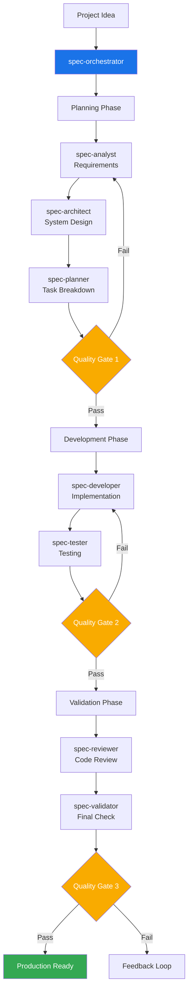

# Claude Sub-Agent Spec Workflow System

A comprehensive AI-driven development workflow system built on Claude Code's Sub-Agents feature. This system transforms project ideas into production-ready code through specialized AI agents working in coordinated phases.

## Table of Contents

- [Overview](#overview)
- [System Architecture](#system-architecture)
- [Installation](#installation)
- [Quick Start](#quick-start)
- [Slash Command Usage](#slash-command-usage)
- [How It Works](#how-it-works)
- [Agent Reference](#agent-reference)
- [Usage Examples](#usage-examples)
- [Quality Gates](#quality-gates)
- [Best Practices](#best-practices)
- [Advanced Usage](#advanced-usage)
- [Troubleshooting](#troubleshooting)

## Overview

The Spec Workflow System leverages Claude Code's Sub-Agents capability to create a multi-agent development pipeline. Each agent is a specialized expert that handles specific aspects of the software development lifecycle, from requirements analysis to final validation.

### Key Features

- **Automated Workflow**: Complete development pipeline from idea to production code
- **Specialized Expertise**: Each agent focuses on their domain of expertise
- **Quality Gates**: Automated checkpoints ensure quality standards
- **Flexible Integration**: Works with existing specialized agents
- **Comprehensive Documentation**: Every phase produces detailed artifacts

### Benefits

- 10x faster development from concept to code
- Consistent quality through automated validation
- Comprehensive documentation generated automatically
- Reduced errors through systematic processes
- Better collaboration through clear workflows

## System Architecture



## Installation

### Prerequisites

- Claude Code (latest version)
- Project directory initialized
- Basic understanding of AI-assisted development

### Setup Steps

1. **Download the agents**

   ```bash
   # Option 1: Clone the repository
   git clone https://github.com/zhsama/claude-sub-agent.git
   cd claude-sub-agent
   
   # Option 2: Download specific agents you need
   # Individual agent files are available in the agents/ directory
   ```

2. **Copy agents and slash command to your project's Claude Code directory**

   ```bash
   # Create .claude directory structure in your project
   mkdir -p .claude/agents .claude/commands
   
   # Copy agents from this repository
   cp agents/* .claude/agents/
   
   # Copy slash commands (including workflow resume commands)
   cp commands/agent-workflow*.md .claude/commands/
   ```

3. **Verify installation**

   Your project structure should look like this:

   ```text
   your-project/
   ├── .claude/
   │   ├── commands/
   │   │   ├── agent-workflow.md         # Workflow start command
   │   │   ├── agent-workflow-resume.md  # Workflow resume command
   │   │   └── agent-workflow-list.md    # Workflow list command
   │   └── agents/
   │       ├── spec-analyst.md
   │       ├── spec-architect.md
   │       ├── spec-developer.md
   │       ├── spec-orchestrator.md
   │       ├── spec-planner.md
   │       ├── spec-reviewer.md
   │       ├── spec-tester.md
   │       ├── spec-validator.md
   │       └── ... (other agents)
   └── ... (your project files)
   ```

## Quick Start

### Basic Usage

```bash
# Start a new project workflow
Ask Claude: "Use the spec-orchestrator agent to create a todo list web application"

# The orchestrator will automatically:
# 1. Analyze requirements
# 2. Design architecture
# 3. Plan tasks
# 4. Implement code
# 5. Write tests
# 6. Review and validate
```

### Simple Example

```markdown
You: Use spec-orchestrator to create a personal blog platform

Claude (spec-orchestrator): Starting workflow for personal blog platform...

[Planning Phase - 45 minutes]
✓ Requirements analyzed
✓ Architecture designed
✓ Tasks planned
✓ Quality Gate 1: PASSED (96/100)

[Development Phase - 2 hours]
✓ 15 tasks implemented
✓ Tests written
✓ Quality Gate 2: PASSED (88/100)

[Validation Phase - 30 minutes]
✓ Code reviewed
✓ Final validation complete
✓ Quality Gate 3: PASSED (91/100)

Project complete! Generated artifacts:
- requirements.md
- architecture.md
- Source code (15 files)
- Test suites (85% coverage)
- Documentation
```

## Slash Command Usage

For the quickest way to start a complete workflow, use our custom slash command:

### Basic Usage

```bash
/agent-workflow "Create a task management web application with user authentication and real-time updates"
```

### Advanced Usage

```bash
# High-quality enterprise project
/agent-workflow "Develop a CRM system with customer management and analytics" --quality=95

# Quick prototype development  
/agent-workflow "Simple personal blog website" --quality=75 --skip-agent=spec-tester

# From existing requirements
/agent-workflow "Mobile app based on existing requirements" --skip-agent=spec-analyst

# Specific phases only
/agent-workflow "Microservices e-commerce platform" --phase=planning
```

### Command Options

- `--quality=[75-95]`: Set quality gate threshold
- `--skip-agent=[agent-name]`: Skip specific agents
- `--phase=[planning|development|validation|all]`: Run specific phases
- `--output-dir=[path]`: Specify output directory
- `--language=[zh|en]`: Documentation language

### Workflow Resume Feature

When workflows are interrupted, you can use the resume functionality to continue from where you left off:

```bash
# Resume specific workflow
/agent-workflow-resume <WORKFLOW_ID>

# Auto-resume most recent incomplete workflow
/agent-workflow-resume

# List all resumable workflows
/agent-workflow-list
```

#### Resume Features

- **State Persistence**: Automatically saves workflow progress and context
- **Smart Recovery**: Continues from the last completed phase
- **Session Awareness**: Monitors session time limits and auto-pauses long tasks
- **Error Recovery**: Handles corrupted states and missing workflows

**📖 For complete slash command documentation, see [commands/agent-workflow.md](./commands/agent-workflow.md)**

## How It Works

### 1. Claude Code Sub-Agents Integration

According to Claude Code's documentation, sub-agents work by:

- Operating in isolated context windows
- Preventing pollution of the main conversation
- Allowing specialized, focused interactions
- Being automatically selected based on task context

Our system leverages these features by creating specialized agents for each development phase.

### 2. Workflow Phases

#### Planning Phase

1. **spec-analyst**: Analyzes requirements and creates user stories
2. **spec-architect**: Designs system architecture
3. **spec-planner**: Breaks down work into tasks
4. **Quality Gate 1**: Validates planning completeness

#### Development Phase

1. **spec-developer**: Implements code based on tasks
2. **spec-tester**: Writes comprehensive tests
3. **Quality Gate 2**: Validates code quality

#### Validation Phase

1. **spec-reviewer**: Reviews code for best practices
2. **spec-validator**: Final production readiness check
3. **Quality Gate 3**: Ensures deployment readiness

### 3. Agent Communication

Agents communicate through structured artifacts:

- Each agent produces specific documents
- Next agent uses previous outputs as input
- Orchestrator manages the flow
- Quality gates ensure consistency

## Agent Reference

### Workflow Agents

| Agent | Purpose | Inputs | Outputs |
|-------|---------|--------|---------|
| spec-orchestrator | Workflow coordination | Project description | Status reports, routing |
| spec-analyst | Requirements analysis | User description | requirements.md, user-stories.md |
| spec-architect | System design | Requirements | architecture.md, api-spec.md |
| spec-planner | Task planning | Architecture | tasks.md, test-plan.md |
| spec-developer | Implementation | Tasks | Source code, unit tests |
| spec-tester | Testing | Code | Test suites, coverage reports |
| spec-reviewer | Code review | Code | Review report, improvements |
| spec-validator | Final validation | All artifacts | Validation report, quality score |

### Specialist Agents

| Agent | Domain | Integration Point |
|-------|--------|-------------------|
| ui-ux-master | UI/UX Design | Planning phase |
| senior-backend-architect | Backend Systems | Architecture phase |
| senior-frontend-architect | Frontend Systems | Development phase |
| refactor-agent | Code Quality | Any phase |

## Usage Examples

### Example 1: Enterprise Application

```bash
# High-quality enterprise system
Use spec-orchestrator with quality threshold 95:
Create an enterprise CRM system with:
- Multi-tenancy support
- Role-based access control
- RESTful API
- Real-time dashboard
- Audit logging
```

### Example 2: Quick Prototype

```bash
# Fast prototype with lower quality threshold
Use spec-orchestrator with quality threshold 75 and skip analyst:
Create a simple landing page with email capture
```

### Example 3: Existing Requirements

```bash
# Start from existing documentation
Use spec-orchestrator starting from requirements:
Load requirements from ./docs/requirements.md and continue workflow
```

### Example 4: Specific Phase Only

```bash
# Run only validation on existing code
Use spec-orchestrator for validation phase only:
Validate the project in ./my-app/
```

## Quality Gates

### Gate 1: Planning Quality (95% threshold)

- Requirements completeness
- Architecture feasibility
- Task breakdown quality
- User story clarity

### Gate 2: Development Quality (80% threshold)

- Test coverage
- Code quality metrics
- Security scan results
- Performance benchmarks

### Gate 3: Production Readiness (85% threshold)

- Overall quality score
- Documentation completeness
- Deployment readiness
- Operational requirements

## Best Practices

### 1. Project Preparation

- Write clear project descriptions
- Include constraints and requirements
- Specify quality expectations
- Provide existing documentation

### 2. Working with Agents

- Let each agent complete their phase
- Review artifacts between phases
- Use feedback loops effectively
- Trust the quality gates

### 3. Customization

- Adjust quality thresholds based on needs
- Skip agents for simpler projects
- Add custom validation criteria
- Integrate with existing workflows

### 4. Performance Optimization

- Enable parallel execution for large projects
- Cache results for iterative development
- Use phase-specific execution
- Monitor resource usage

## Advanced Usage

### Workflow State Management

#### Workflow Persistence

```bash
# Set custom workflow storage directory
export CLAUDE_WORKFLOW_DIR="./my-workflows"

# Auto-save workflow state to specified directory
/agent-workflow "E-commerce platform development" --save-state

# Resume workflow from specific directory
/agent-workflow-resume --from-dir "./backup-workflows"
```

#### Workflow Backup and Recovery

```bash
# Backup all workflow states
tar -czf workflows-backup-$(date +%Y%m%d).tar.gz .claude/workflows/

# Restore workflow states
tar -xzf workflows-backup-20240802.tar.gz

# Batch cleanup of expired workflows (older than 30 days)
find .claude/workflows/ -name "*.json" -mtime +30 -delete
```

### Custom Workflow Templates

#### Creating Reusable Workflow Templates

```yaml
# .claude/templates/enterprise-web-app.yml
name: "Enterprise Web Application Template"
description: "Standard enterprise web application development process"
config:
  quality_threshold: 95
  skip_agents: []
  phases:
    - spec-analyst
    - spec-architect  
    - spec-planner
    - spec-developer
    - spec-tester
    - spec-reviewer
    - spec-validator
  custom_validators:
    - security-scan
    - performance-test
    - accessibility-check
  required_artifacts:
    - requirements.md
    - architecture.md
    - api-spec.md
    - test-plan.md
    - deployment-guide.md
```

```bash
# Use template to start workflow
/agent-workflow "New CRM System" --template=enterprise-web-app

# List available templates
/agent-workflow --list-templates
```

#### Domain-Specific Workflows

```yaml
# .claude/templates/mobile-app.yml
name: "Mobile Application Development Template"
config:
  quality_threshold: 90
  focus_areas: [performance, security, ux]
  platform_specific:
    ios: 
      - swift-validation
      - app-store-guidelines
    android:
      - kotlin-validation  
      - play-store-guidelines
  testing_strategy:
    - unit_tests: 80%
    - integration_tests: 60%
    - e2e_tests: 40%
    - performance_tests: required
```

### Advanced Agent Configuration

#### Agent Capability Extensions

```markdown
# .claude/agents/custom-security-validator.md
---
description: "Professional security validation agent focused on vulnerability detection and security best practices"
capabilities: ["security-scan", "vulnerability-assessment", "compliance-check"]
integration_points: ["spec-reviewer", "spec-validator"]
---

# Custom Security Validation Agent

Performs comprehensive security analysis:
- OWASP Top 10 vulnerability detection
- Dependency security scanning
- Static security code analysis
- Configuration security checks
- Data privacy compliance validation
```

#### Custom Agent Execution Chains

```python
# Custom agent execution sequence
custom_workflow = {
    "phases": [
        {
            "name": "enhanced-planning",
            "agents": ["spec-analyst", "ui-ux-master", "spec-architect"],
            "parallel": True,
            "timeout": "60min"
        },
        {
            "name": "development",
            "agents": ["spec-planner", "spec-developer"],
            "parallel": False,
            "dependencies": ["enhanced-planning"]
        },
        {
            "name": "quality-assurance",
            "agents": ["spec-tester", "custom-security-validator", "spec-reviewer"],
            "parallel": True,
            "quality_gate": 92
        }
    ]
}
```

### Enterprise Integration

#### CI/CD Pipeline Integration

```yaml
# .github/workflows/ai-development.yml
name: AI-Driven Development Pipeline
on:
  push:
    branches: [feature/*]
  pull_request:
    branches: [main]

jobs:
  ai-development:
    runs-on: ubuntu-latest
    steps:
      - uses: actions/checkout@v4
      
      - name: Setup Claude Code Environment
        run: |
          curl -sSL https://get.claude.ai/install.sh | sh
          claude-code auth ${{ secrets.CLAUDE_API_KEY }}
      
      - name: Run Planning Phase
        if: github.event_name == 'push'
        run: |
          /agent-workflow "${{ github.event.head_commit.message }}" \
            --phase=planning \
            --output-dir=./planning-artifacts
      
      - name: Code Quality Validation
        if: github.event_name == 'pull_request'
        run: |
          /agent-workflow-resume --phase=validation \
            --strict-mode \
            --fail-on-quality=90
      
      - name: Upload Workflow Artifacts
        uses: actions/upload-artifact@v3
        with:
          name: ai-development-artifacts
          path: |
            ./planning-artifacts/
            ./.claude/workflows/
```

#### Jenkins Integration

```groovy
// Jenkinsfile
pipeline {
    agent any
    
    stages {
        stage('AI Development Planning') {
            when { 
                branch 'feature/*' 
            }
            steps {
                script {
                    def featureName = env.BRANCH_NAME.replace('feature/', '')
                    sh """
                        /agent-workflow "${featureName}" \
                            --phase=planning \
                            --quality=95 \
                            --output-format=json
                    """
                }
            }
            post {
                always {
                    archiveArtifacts artifacts: '.claude/workflows/*.json'
                }
            }
        }
        
        stage('AI Code Review') {
            when {
                changeRequest()
            }
            steps {
                sh '''
                    /agent-workflow-resume \
                        --phase=validation \
                        --generate-report
                '''
            }
            post {
                always {
                    publishHTML([
                        allowMissing: false,
                        alwaysLinkToLastBuild: true,
                        keepAll: true,
                        reportDir: '.claude/reports',
                        reportFiles: 'validation-report.html',
                        reportName: 'AI Code Review Report'
                    ])
                }
            }
        }
    }
}
```

### Monitoring and Analytics

#### Workflow Performance Monitoring

```bash
# Enable detailed monitoring
export CLAUDE_WORKFLOW_METRICS=true
export CLAUDE_WORKFLOW_LOG_LEVEL=debug

# Workflow execution time analysis
/agent-workflow "Performance optimization project" --profile --benchmark

# Generate performance report
claude-workflow-analyzer --input=.claude/workflows/ --output=performance-report.html
```

#### Quality Trend Analysis

```python
# workflow-analytics.py
import json
import pandas as pd
import matplotlib.pyplot as plt

def analyze_quality_trends():
    workflows = load_workflow_history()
    
    # Quality score trends
    quality_scores = [w['final_quality_score'] for w in workflows]
    dates = [w['completion_date'] for w in workflows]
    
    plt.plot(dates, quality_scores)
    plt.title('Workflow Quality Trends')
    plt.ylabel('Quality Score')
    plt.xlabel('Date')
    plt.show()
    
    # Phase duration analysis
    phase_times = analyze_phase_durations(workflows)
    print(f"Average planning time: {phase_times['planning']} minutes")
    print(f"Average development time: {phase_times['development']} minutes")
    print(f"Average validation time: {phase_times['validation']} minutes")

# Run analysis
analyze_quality_trends()
```

### Team Collaboration Enhancement

#### Workflow Sharing and Collaboration

```bash
# Share workflow state
/agent-workflow "Team project" --share-with="team@company.com"

# Start collaborative workflow
/agent-workflow "Multi-person collaborative project" --collaborative \
    --reviewers="alice@company.com,bob@company.com" \
    --auto-notify

# Workflow permission management
claude-workflow-acl --workflow-id=workflow_123 \
    --grant-read="team-leads" \
    --grant-write="senior-devs"
```

#### Code Review Integration

```yaml
# .claude/config/review-rules.yml
review_rules:
  automatic_reviewers:
    - role: "senior-developer"
      required_for: ["spec-developer", "spec-reviewer"]
    - role: "security-expert" 
      required_for: ["custom-security-validator"]
    - role: "ui-ux-expert"
      required_for: ["ui-ux-master"]
  
  quality_gates:
    planning: 
      min_score: 95
      required_approvals: 2
    development:
      min_score: 90
      required_approvals: 1
      auto_merge: false
    validation:
      min_score: 95
      required_approvals: 3
      auto_merge: true
```

### System Extensions

#### Creating Custom Agents

```bash
# Agent generator
claude-agent-generator \
    --name="custom-database-architect" \
    --domain="database-design" \
    --capabilities="schema-design,query-optimization,migration-planning" \
    --integration-points="spec-architect,spec-developer"
```

#### Plugin Development

```javascript
// claude-workflow-plugin.js
class CustomValidatorPlugin {
    constructor(config) {
        this.config = config;
    }
    
    async validate(artifacts) {
        // Custom validation logic
        const results = await this.runCustomValidation(artifacts);
        return {
            score: results.score,
            feedback: results.feedback,
            required_actions: results.actions
        };
    }
    
    async runCustomValidation(artifacts) {
        // Implement specific validation rules
        return {
            score: 95,
            feedback: "Validation passed",
            actions: []
        };
    }
}

module.exports = CustomValidatorPlugin;
```

### Performance Optimization

#### Workflow Caching Strategy

```bash
# Enable intelligent caching
export CLAUDE_WORKFLOW_CACHE=redis://localhost:6379
export CLAUDE_CACHE_TTL=3600  # 1 hour

# Cache warming
/agent-workflow --cache-warm \
    --templates="enterprise-web-app,mobile-app" \
    --common-artifacts="requirements,architecture"

# Cache cleanup
claude-cache-manager --clean-expired --optimize-storage
```

#### Parallel Execution Optimization

```yaml
# .claude/config/performance.yml
execution:
  max_parallel_agents: 4
  timeout_settings:
    planning_phase: 60min
    development_phase: 180min
    validation_phase: 45min
  
  resource_limits:
    memory_per_agent: 2GB
    cpu_per_agent: 2cores
    
  optimization:
    enable_lazy_loading: true
    prefetch_dependencies: true
    compress_artifacts: true
```

### Extending the System

1. **Add New Agents**
   - Create agent with YAML frontmatter
   - Define clear responsibilities
   - Specify input/output formats
   - Update orchestrator routing

2. **Custom Quality Gates**
   - Define new criteria
   - Set appropriate thresholds
   - Implement validation logic
   - Add to workflow

3. **Domain-Specific Workflows**
   - Create specialized orchestrators
   - Define domain patterns
   - Customize quality criteria
   - Optimize for specific needs

## Troubleshooting

### Common Issues

1. **Agent Not Found**
   - Verify agents are in correct directory
   - Check YAML frontmatter format
   - Ensure proper file permissions

2. **Quality Gate Failures**
   - Review specific criteria that failed
   - Check artifact completeness
   - Allow agents to revise work
   - Consider adjusting thresholds

3. **Workflow Stuck**
   - Check orchestrator status
   - Review last agent output
   - Look for error messages
   - Restart from last checkpoint

### Debug Mode

```bash
# Enable verbose logging
Use spec-orchestrator with debug mode:
Create test project and show all agent interactions
```

## Contributing

We welcome contributions! Please:

1. Follow the existing agent format
2. Add comprehensive documentation
3. Include usage examples
4. Test with the orchestrator
5. Submit PR with description

## License

MIT License - see LICENSE file for details

## Acknowledgments

- Built on Claude Code's Sub-Agents feature
- Inspired by BMAD methodology
- Community contributions welcome

---

For more information, see:

- [Claude Code Documentation](https://docs.anthropic.com/en/docs/claude-code)
- [Sub-Agents Guide](https://docs.anthropic.com/en/docs/claude-code/sub-agents)
- [Project Issues](https://github.com/zhsama/claude-sub-agent/issues)
